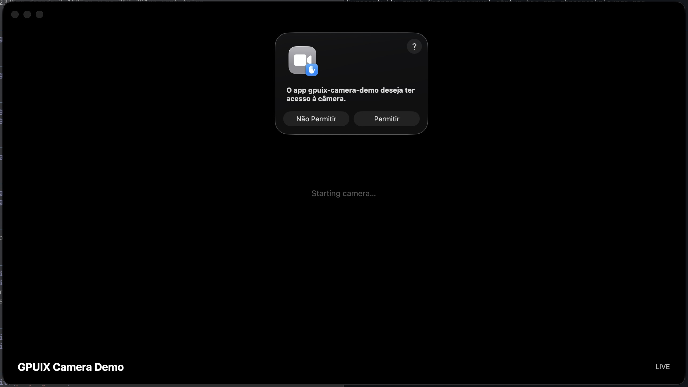
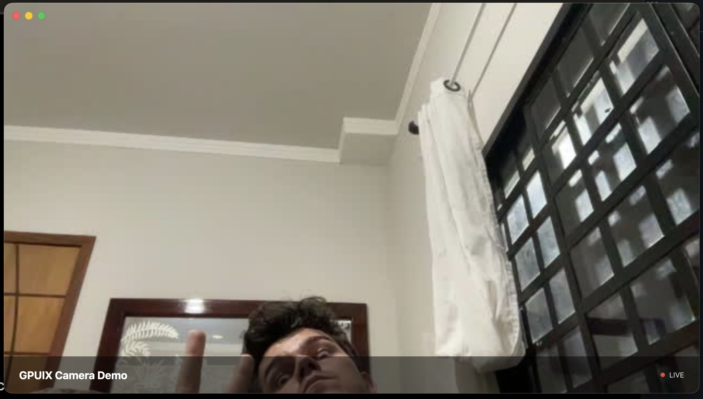

# GPUIX Camera Demo

A native desktop camera viewer built entirely with web technologies — no Electron, no Chromium. The UI runs on the GPU via [GPUI](https://www.gpui.rs/), React renders the component tree, Bun compiles and serves everything, and ffmpeg pipes raw MJPEG frames from the system camera into the app in real time.

## Screenshots





## Stack

| Layer | Technology |
|---|---|
| UI framework | [GPUI](https://www.gpui.rs/) — GPU-accelerated native UI from the Zed editor |
| Component model | React 19 (via `@gpuix/react`) |
| Runtime & bundler | [Bun](https://bun.sh) — runs TypeScript directly, compiles to a single binary |
| Camera capture | [ffmpeg](https://ffmpeg.org) — spawned as a subprocess, streams MJPEG over stdout |
| Language | TypeScript |

## Development

```bash
bun install
bun run dev        # hot-reload
```

## Build

```bash
bun run build:mac       # produces dist/gpuix-camera-demo.dmg
bun run build:windows   # produces packaging/output/gpuix-camera-demo-{version}-setup.exe (requires PowerShell + NSIS)
```

### Prerequisites

- **macOS:** `brew install ffmpeg`
- **Windows:** `choco install ffmpeg nsis`

## Release

Pushing a `v*` tag triggers the GitHub Actions workflow, which builds both platforms in parallel and attaches the DMG and Windows installer to the GitHub Release automatically.

```bash
git tag v1.0.0 && git push origin v1.0.0
```
